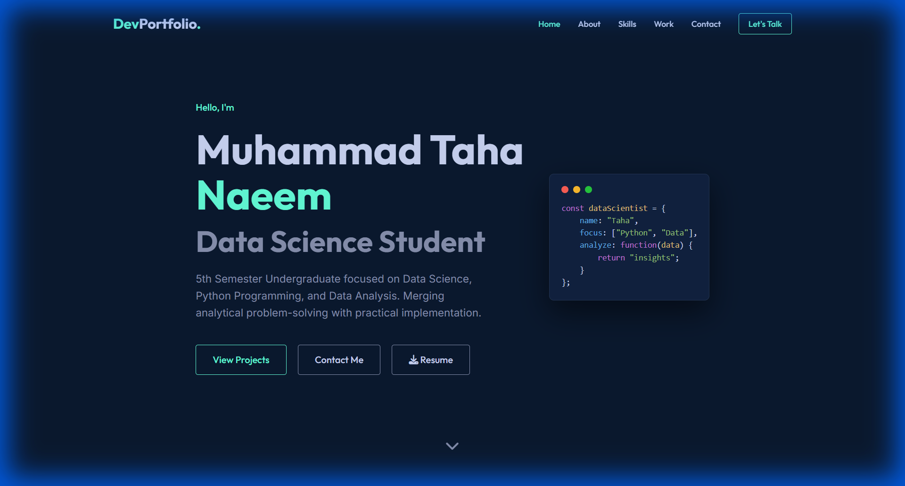

# 👨‍💻 Data Science Portfolio



[](https://graceful-profiterole-beef38.netlify.app)


A modern, responsive, and aesthetically pleasing portfolio website designed to showcase my Data Science projects and technical skills. Built with vanilla HTML, CSS, and JavaScript, focusing on clean code, smooth animations, and a premium dark mode experience.

**🚀 Live Demo:** [https://graceful-profiterole-beef38.netlify.app](https://graceful-profiterole-beef38.netlify.app)

## ✨ Features

-   **🎨 Modern Dark UI:** Sleek, professional dark theme with teal accents (`#64ffda`).
-   **📱 Fully Responsive:** Optimized for desktops, tablets, and mobile devices.
-   **⚡ Fast Performance:** Lightweight code with lazy loading and optimized assets.
-   **🎬 Smooth Animations:** Scroll-triggered fade-in effects using `IntersectionObserver`.
-   **📄 Resume Download:** Direct link to download my resume from the Hero section.
-   **🔍 SEO Optimized:** Proper meta tags and Open Graph support for social sharing.

## 📸 Screenshots

| Hero Section | Projects Section |
|:---:|:---:|
|  |  |

## 🛠️ Tech Stack

*   **HTML5:** Semantic markup for better accessibility.
*   **CSS3:** Custom properties (variables), Flexbox, Grid, and Keyframe animations.
*   **JavaScript (ES6):** Logic for mobile menu, sticky navbar, and scroll animations.
*   **Font Awesome:** For scalable vector icons.
*   **Google Fonts:** Using *Inter* for body text and *Outfit* for headings.

## 🚀 Getting Started

To run this project locally:

1.  **Clone the repository:**
    ```bash
    git clone https://github.com/mtahanaeem/Portfolio_Website.git
    ```
2.  **Open `index.html`:**
    Simply open the file in your preferred browser. No server setup required!

## 📦 Deployment

This site is ready for deployment on **Netlify** or **GitHub Pages**.

1.  **Netlify:** Drag and drop the project folder to `app.netlify.com/drop`.
2.  **GitHub Pages:** Go to Settings -> Pages -> Select 'main' branch.

## 📬 Contact

**Muhammad Taha Naeem** - Data Science Student

*   📧 Email: [muhamadtahanaeem.pro@gmail.com](mailto:muhamadtahanaeem.pro@gmail.com)
*   👔 LinkedIn: [linkedin.com/in/heyitxtaha](https://www.linkedin.com/in/heyitxtaha/)
*   🐙 GitHub: [github.com/mtahanaeem](https://github.com/mtahanaeem)

---
*⭐️ Star this repo if you find it helpful!*
